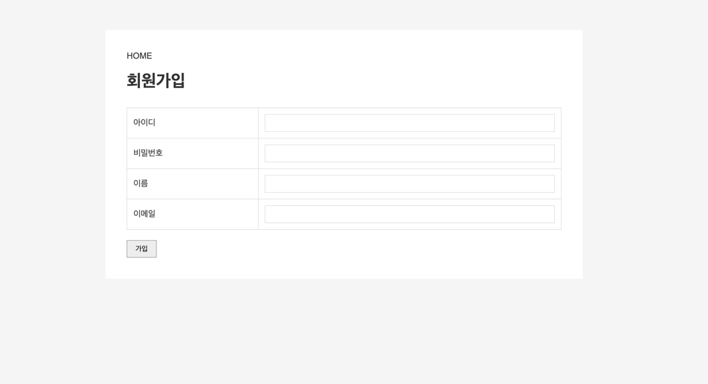
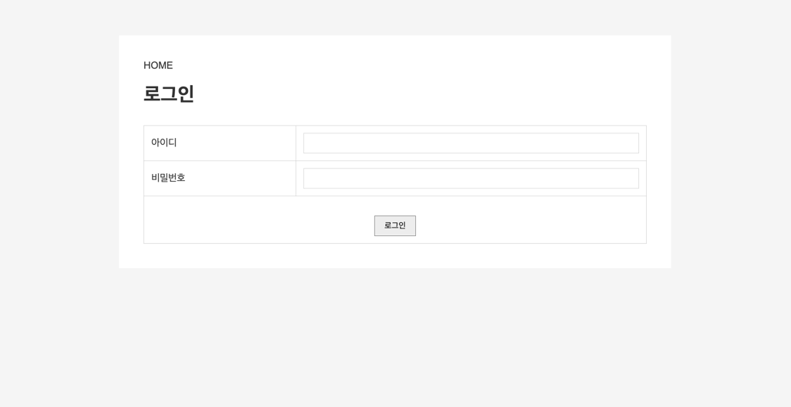
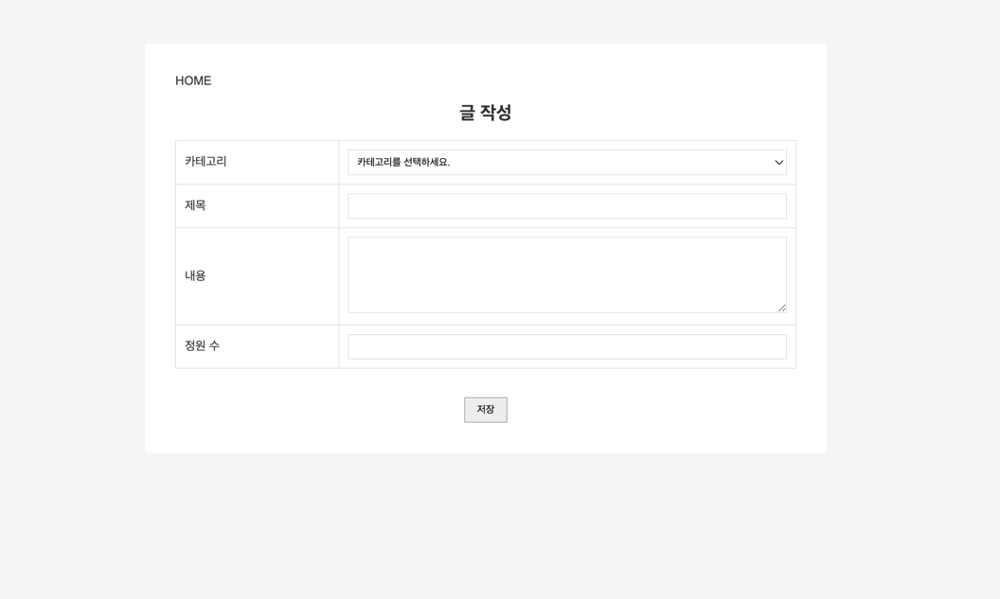
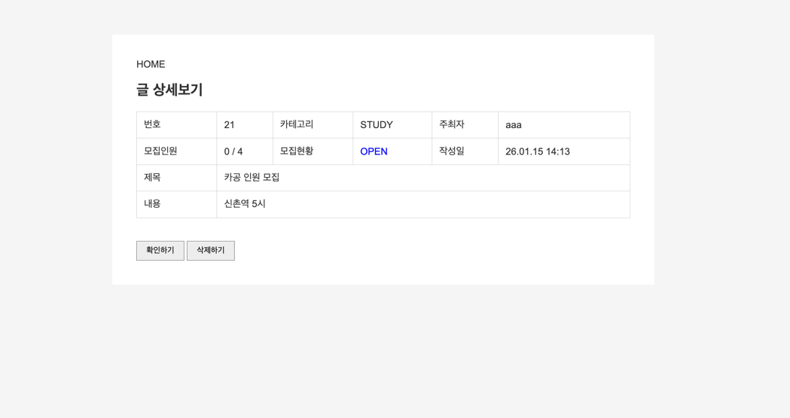
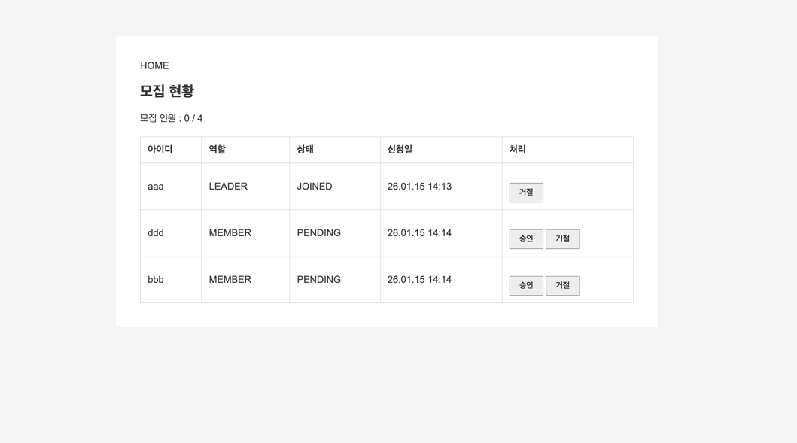
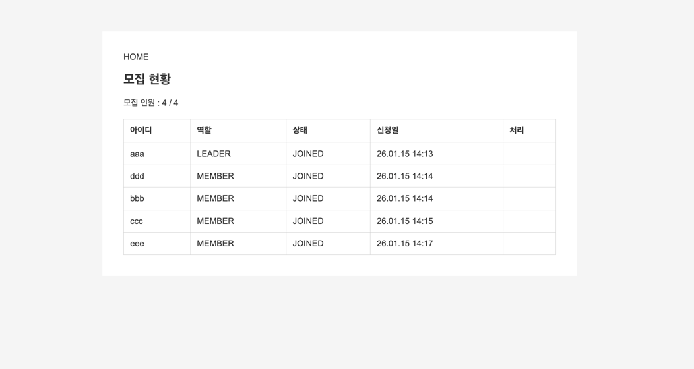
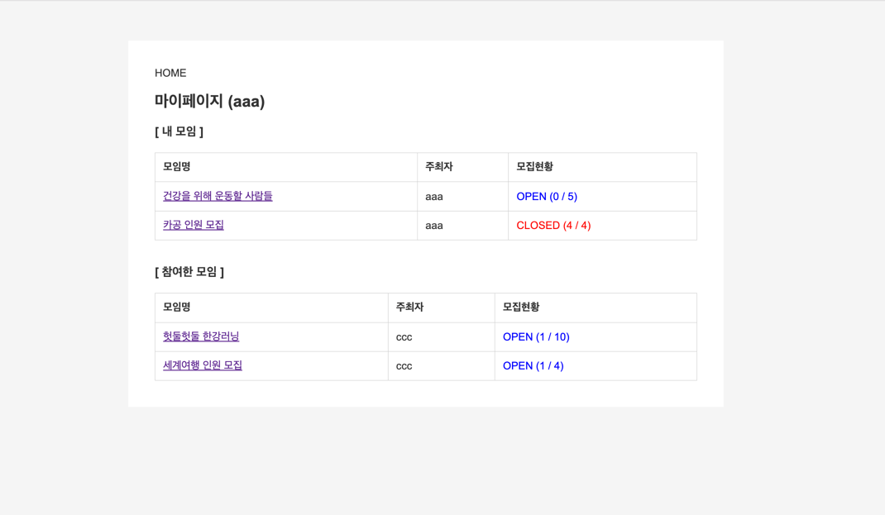

# 📘 SCIT 48기 백엔드 과제 3 : Spring Boot 커뮤니티

Spring Boot와 JPA를 활용하여 구현한 **간단한 커뮤니티 웹 애플리케이션**입니다.  
회원 관리, 모집 게시글, 모임 참여 및 승인 기능을 중심으로  
백엔드 전반의 흐름을 이해하고 구현하는 것을 목표로 한 과제입니다.

---

## 📌 프로젝트 개요

- **과정**: SCIT 48기 백엔드 과정
- **주제**: 커뮤니티 게시판 및 모임 관리 시스템
- **목표**
    - Spring Boot 기반 MVC 구조 이해
    - JPA를 활용한 엔티티 및 연관관계 설계
    - 로그인/권한에 따른 기능 분기 처리
    - CRUD 중심의 웹 애플리케이션 구현

---

## ⚙️ 주요 기능

### 1️⃣ 회원가입 / 로그인

- 회원가입 시 아이디, 비밀번호, 이름, 이메일 정보를 입력받아 회원 정보를 저장
- 입력값에 대한 기본적인 유효성 검사 수행
- Spring Security를 이용한 로그인 / 로그아웃 처리
- 로그인 성공 시 메인 화면으로 이동하며, 실패 시 로그인 페이지로 재이동
- 로그인 여부에 따라 접근 가능한 메뉴 및 기능이 다르게 출력

---

### 2️⃣ 게시글 조회

- 모집 게시글 목록을 테이블 형태로 출력
- 카테고리(STUDY / HEALTHY / TRIP) 선택 시 해당 카테고리에 맞는 게시글만 조회
- 모집 상태(OPEN / CLOSED)를 색상으로 구분하여 가독성 향상
- 현재 참여 인원 수와 전체 정원 수를 함께 표시

---
### 3️⃣ 게시글 작성

- 로그인한 사용자만 게시글 작성 가능
- 카테고리, 제목, 내용, 정원 수 입력 후 게시글 등록
- 필수 항목 미입력 시 경고 메시지 출력
- 게시글 등록 완료 후 게시판 목록으로 이동

---

### 4️⃣ 게시글 상세보기 / 모임 신청

- 게시글 상세 정보(카테고리, 작성자, 모집 상태, 인원 수, 내용) 출력
- 모집 상태가 OPEN인 경우에만 신청 가능
- 동일 사용자의 중복 신청 방지 처리 (alert 메세지)
- 모집이 마감된 게시글(CLOSED)은 신청 버튼 미출력

---
### 5️⃣ 모집 현황 확인 및 승인 / 거절

- 게시글 작성자(LEADER)만 모집 현황 페이지 접근 가능
- 신청자의 역할(LEADER / MEMBER) 및 상태(PENDING / JOINED / REJECTED) 관리
- 승인 시 참여 인원 수 증가
- 거절 시 상태 변경 처리
- 정원이 가득 찰 경우 모집 상태 자동으로 CLOSED 처리

---

### 5️⃣ 마이페이지

- 로그인한 사용자 정보 출력
- 내가 주최한 모임과 참여 중인 모임을 구분하여 출력
- 승인된(JOINED) 모임만 참여 목록에 표시
- 모임 클릭 시 해당 게시글 상세 페이지로 이동

---

## 🛠️ 기술 스택

### Environment

### Backend

### Frontend

### Database

